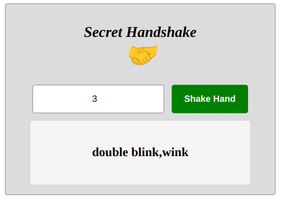

# JS Secret Handshake

this project is all about converting a given number to the appropriate sequence of events for a secret handshake.
1 = wink
10 = double blink
100 = close your eyes
1000 = jump
10000 = Reverse the order of the operations in the secret handshake

## App

### Built With

- HTML
- CSS
- JS

### Prerequisites

Knowledge about:

- HTML
- CSS
- Google chrome
- JS

## Clone project

- To get a local copy up and running follow these simple example steps.
- Clone this repository with `git@github.com:NoubissiViany/jsSecretHandshake.git` using your terminal.
- Change to the project directory by entering: cd jsSecretHandshake the terminal.

## steps

- $ git clone `git@github.com:NoubissiViany/jsSecretHandshake.git`
- $ `cd jsSecretHandshake`
- $ `git checkout feature/Secret-Handshake`

## Start App

- run by opening the index.html in the browser

## Author

👤 **NoubissiViany**

- GitHub: [@NoubissiViany](git@github.com:NoubissiViany/jsSecretHandshake.git)

## 📝 License

This project is [Rebase Academy](./LICENSE) licensed.
